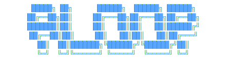

<div align="center">
<picture>
  
</picture>

**One loop is all you need.**

ouro is an AI agent built on a single, unified loop. Planning, parallel sub-agents,
self-verification — everything folds into the same loop, chosen autonomously by the
agent itself, not by a hardcoded workflow. Simple architecture, emergent capability.


</div>

## Installation

Prerequisites: Python 3.12+.

```bash
pip install ouro
```

Or install from source (for development):

```bash
git clone https://github.com/ouro-ai-labs/ouro.git
cd ouro
./scripts/bootstrap.sh   # requires uv
```

## Quick Start

### 1. Configure Models

On first run, `~/.ouro/models.yaml` is created with a template. Edit it to add your provider and API key:

```yaml
models:
  openai/gpt-4o:
    api_key: sk-...

  anthropic/claude-3-5-sonnet-20241022:
    api_key: sk-ant-...

  ollama/llama2:
    api_base: http://localhost:11434

default: openai/gpt-4o
```

See [LiteLLM Providers](https://docs.litellm.ai/docs/providers) for the full list.

### 2. Run

```bash
# Interactive mode
ouro

# Single task (returns raw result)
ouro --task "Calculate 123 * 456"

# Resume last session
ouro --resume

# Resume specific session (ID prefix)
ouro --resume a1b2c3d4
```

## CLI Reference

| Flag | Short | Description |
|------|-------|-------------|
| `--task TEXT` | `-t` | Run a single task and exit |
| `--model ID` | `-m` | LiteLLM model ID to use |
| `--resume [ID]` | `-r` | Resume a session (`latest` if no ID given) |
| `--verbose` | `-v` | Enable verbose logging to `~/.ouro/logs/` |

## Interactive Commands

### Slash Commands

| Command | Description |
|---------|-------------|
| `/help` | Show help |
| `/clear` | Clear conversation and start fresh |
| `/stats` | Show memory and token usage statistics |
| `/resume [id]` | List or resume a previous session |
| `/model` | Pick a model (arrow keys + Enter) |
| `/model edit` | Open `~/.ouro/models.yaml` in editor (auto-reload on save) |
| `/theme` | Toggle dark/light theme |
| `/verbose` | Toggle thinking display |
| `/compact` | Toggle compact output |
| `/exit` | Exit (also `/quit`) |

### Keyboard Shortcuts

| Key | Action |
|-----|--------|
| `/` | Command autocomplete |
| `Ctrl+C` | Cancel current operation |
| `Ctrl+L` | Clear screen |
| `Ctrl+T` | Toggle thinking display |
| `Ctrl+S` | Show quick stats |
| Up/Down | Navigate command history |

## How It Works

**Agent loop**: The agent follows a Think-Act-Observe cycle. It reasons about the task, selects a tool, observes the result, and repeats until it has an answer. Planning, sub-agent dispatch, and tool use all happen inside this single loop.

**Ralph verification**: For single tasks (`--task`), an outer loop verifies the agent's answer against the original task. If incomplete, feedback is injected and the agent loop re-enters. Configurable via `RALPH_LOOP_MAX_ITERATIONS` (default: 3).

**Memory compression**: When context grows past a token threshold, older messages are compressed via LLM summarization. Recent messages are kept at full fidelity. Strategies: `sliding_window` (default), `selective`, `deletion`.

**Session persistence**: Conversations are saved as YAML files under `~/.ouro/sessions/`. Resume with `--resume` or `/resume`.

## Features

- **AGENTS.md support**: Project-specific instructions guide the agent automatically (see [AGENTS.md Guide](docs/agents-md-guide.md))
- **Memory management**: Automatic compression and persistence of conversation history
- **Ralph verification**: Self-verification loop for single tasks
- **Tool-rich**: 18+ specialized tools for file ops, code navigation, web search, and more

## Tools

| Tool | Description |
|------|-------------|
| `read_file` | Read file contents |
| `write_file` | Write content to a file |
| `search_files` | Search for files by name |
| `edit_file` | Exact string replacement in files |
| `smart_edit` | LLM-assisted file editing |
| `glob_files` | Glob pattern file matching |
| `grep_content` | Regex search in file contents |
| `calculate` | Evaluate expressions / run Python code |
| `shell` | Execute shell commands |
| `shell_task_status` | Check background shell task status |
| `web_search` | Web search (DuckDuckGo) |
| `web_fetch` | Fetch and extract web page content |
| `explore_context` | Explore project structure and context |
| `parallel_execute` | Run multiple tool calls in parallel |
| `notify` | Send email notifications (Resend) |
| `manage_todo_list` | Manage a task/todo list |

## Project Structure

```
ouro/
├── main.py                 # Entry point (argparse)
├── cli.py                  # CLI wrapper (`ouro` entry point)
├── interactive.py          # Interactive session, model setup, TUI
├── config.py               # Runtime config (~/.ouro/config)
├── agent/
│   ├── base.py             # BaseAgent (ReAct + Ralph loops)
│   ├── agent.py            # LoopAgent
│   ├── verification.py     # LLMVerifier for Ralph loop
│   ├── context.py          # Context injection (cwd, platform, date)
│   ├── tool_executor.py    # Tool execution engine
│   └── todo.py             # Todo list data structure
├── llm/
│   ├── litellm_adapter.py  # LiteLLM adapter (100+ providers)
│   ├── model_manager.py    # Model config from ~/.ouro/models.yaml
│   ├── retry.py            # Retry with exponential backoff
│   └── message_types.py    # LLMMessage, LLMResponse, ToolCall
├── memory/
│   ├── manager.py          # Memory orchestrator + persistence
│   ├── compressor.py       # LLM-driven compression
│   ├── short_term.py       # Short-term memory (sliding window)
│   ├── token_tracker.py    # Token counting + cost tracking
│   ├── types.py            # Core data structures
│   └── store/
│       └── yaml_file_memory_store.py  # YAML session persistence
├── tools/                  # 18 tool implementations
├── utils/
│   ├── tui/                # TUI components (input, themes, status bar)
│   ├── logger.py           # Logging setup
│   └── model_pricing.py    # Model pricing data
├── docs/                   # Documentation
├── test/                   # Tests
├── scripts/                # Dev scripts (bootstrap.sh, dev.sh)
└── rfc/                    # RFC design documents
```

## Configuration

Runtime settings live in `~/.ouro/config` (auto-created). Key settings:

| Setting | Default | Description |
|---------|---------|-------------|
| `MAX_ITERATIONS` | `1000` | Maximum agent loop iterations |
| `TOOL_TIMEOUT` | `600` | Tool execution timeout (seconds) |
| `RALPH_LOOP_MAX_ITERATIONS` | `3` | Max verification attempts |
| `MEMORY_ENABLED` | `true` | Enable memory management |
| `MEMORY_COMPRESSION_THRESHOLD` | `60000` | Token threshold for compression |
| `MEMORY_SHORT_TERM_SIZE` | `100` | Messages kept at full fidelity |
| `RETRY_MAX_ATTEMPTS` | `3` | Rate-limit retry attempts |

See [Configuration Guide](docs/configuration.md) for all settings.

## Documentation

- [Configuration](docs/configuration.md) -- model setup, runtime settings, custom endpoints
- [Examples](docs/examples.md) -- usage patterns and programmatic API
- [Memory Management](docs/memory-management.md) -- compression, persistence, token tracking
- [Extending](docs/extending.md) -- adding tools, agents, LLM providers
- [Packaging](docs/packaging.md) -- building, publishing, Docker

## License

MIT License
