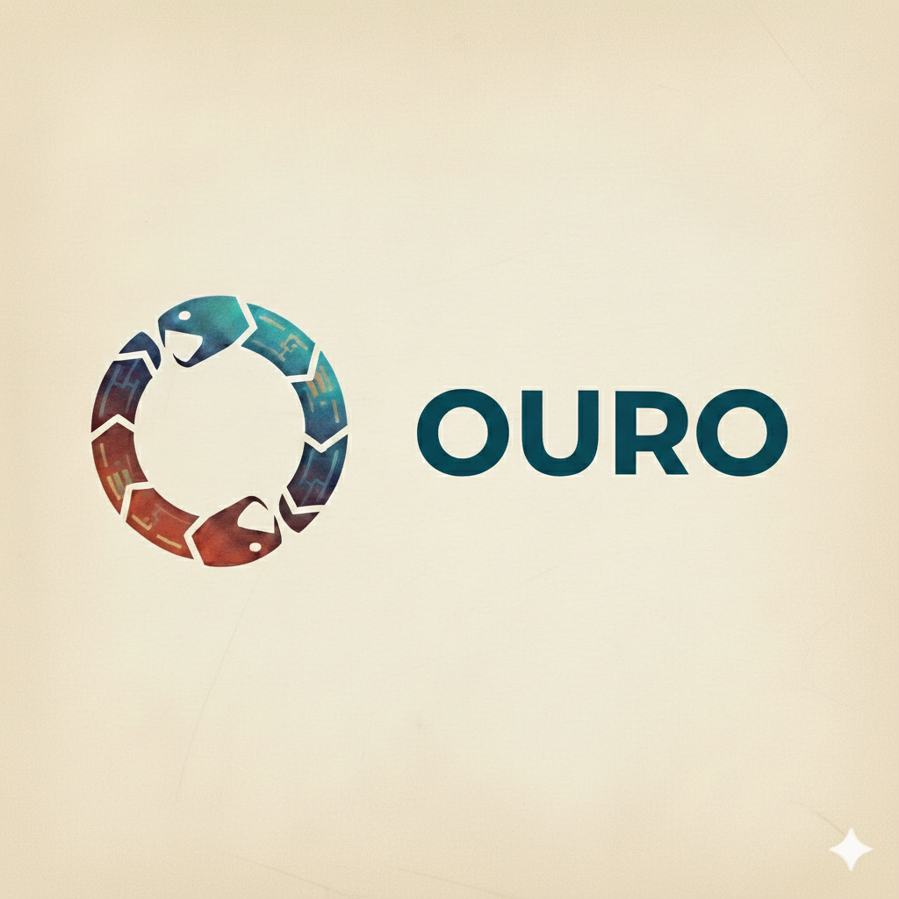
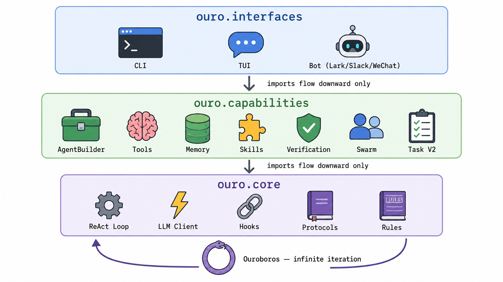

<div align="center">



[](https://pypi.org/project/ouro-ai/)
[](LICENSE)
[]()

*An open-source AI agent — run it as a Coding agent CLI or deploy it as a bot just like JARVIS.*

</div>

Ouro is derived from Ouroboros—the ancient symbol of a serpent consuming its own tail to form a perfect circle. It represents the ultimate cycle: a closed loop of self-consumption, constant renewal, and infinite iteration.

At Ouro AI Lab, this is our blueprint. We are building the next generation of AI agents capable of autonomous evolution—systems that learn from their own outputs, refine their own logic, and achieve a state of infinite self-improvement.

## Two Modes, One Agent

Ouro ships with a unified agent core and two deployment modes:

| | **CLI Mode** | **Bot Mode** |
|---|---|---|
| **What** | Interactive REPL + one-shot task execution | Persistent IM assistant (Lark, Slack) |
| **Install** | `uv tool install ouro-ai` | `uv tool install ouro-ai` |
| **Run** | `ouro-cli` | `ouro-bot` |
| **Guide** | [CLI Guide](docs/cli-guide.md) | [Bot Guide](docs/bot-guide.md) |

## Architecture

Ouro is organized into three layers with strict downward-only imports:



*Each layer has its own README — start with the [umbrella overview](ouro/README.md), then drill into [`core`](ouro/core/README.md), [`capabilities`](ouro/capabilities/README.md), or [`interfaces`](ouro/interfaces/README.md).*

## Features

### 🤖 Agent Team — Multi-Agent Swarm with Persistent Tasks

The flagship feature. Enable with `ENABLE_AGENT_TEAM=true` in `~/.ouro/config`.

- **Persistent Task Store** — SQLite-backed tasks with dependency graphs (`task_create`, `task_claim`, `task_update`, `task_list`, `task_get`, `task_delete`)
- **Atomic Task Claiming** — Agents race to claim available tasks; one agent, one in-progress task
- **Auto-Swarm** — Complex tasks are automatically decomposed and executed by multiple agents in parallel
- **Replaces legacy** `TodoTool` and `MultiTaskTool` when enabled

### 🔄 Self-Verification — Ralph Loop

The agent verifies its own answer against the original task and re-enters the loop if incomplete. Enable with `--verify` or `RALPH_LOOP_MAX_ITERATIONS=3`.

### 🧠 Memory System

LLM-driven compression, file-based long-term memory, FTS5 conversation recall, and YAML session persistence resumable across restarts.

### 💬 Dual Deployment

Same agent core, two modes:
- **CLI** — Interactive REPL with rich TUI, slash commands, session resume
- **Bot** — Persistent IM assistant for Lark, Slack, WeChat with proactive cron scheduling

### 🔐 OAuth Login

`--login` / `/login` to authenticate with ChatGPT Codex subscription models.

### 📊 Benchmarks

First-class [Harbor](https://github.com/laude-institute/harbor) integration for agent evaluation (see [Evaluation](#evaluation)).

## Quick Start

Prerequisites: Python 3.12+ and one of [`uv`](https://docs.astral.sh/uv/) (recommended) or [`pipx`](https://pipx.pypa.io/).

```bash
# Recommended: installs ouro in an isolated environment and exposes global
# `ouro-cli` and `ouro-bot` commands
uv tool install ouro-ai

# Alternative
pipx install ouro-ai

# Upgrading later
uv tool upgrade ouro-ai      # or: pipx upgrade ouro-ai
```

> Plain `pip install ouro-ai` also works but is **not recommended** — it mixes ouro's dependencies into your active Python environment. Use `uv tool` / `pipx` so the `ouro-cli` / `ouro-bot` binaries are on `$PATH` without needing to activate a venv.

On first run, `~/.ouro/models.yaml` is created. Add your API key:

```yaml
models:
  openai/gpt-4o:
    api_key: sk-...
default: openai/gpt-4o
current: openai/gpt-4o
```

Then run:

```bash
# Interactive mode
ouro-cli

# Single task
ouro-cli --task "Calculate 123 * 456"

# Bot mode
ouro-bot
```

See [LiteLLM Providers](https://docs.litellm.ai/docs/providers) for the full provider list.

## Evaluation

Ouro can be evaluated on agent benchmarks using [Harbor](https://github.com/laude-institute/harbor). A convenience script `harbor-run.sh` is provided at the repo root:

1. Edit `harbor-run.sh` to set your model, dataset, and ouro version.
2. Run:

```bash
export OURO_API_KEY=<your-api-key>
./harbor-run.sh                    # run with defaults in the script
./harbor-run.sh -l 5               # limit to 5 tasks
./harbor-run.sh --n-concurrent 4   # 4 parallel workers
```

Extra flags are forwarded to `harbor run`, so any Harbor CLI option works. See [ouro_harbor/README.md](ouro_harbor/README.md) for full details.

## Documentation

- **[CLI Guide](docs/cli-guide.md)** -- interactive mode, task mode, commands, shortcuts
- **[Bot Guide](docs/bot-guide.md)** -- IM bot setup, commands, proactive mechanisms, personality
- [Configuration](docs/configuration.md) -- model setup, runtime settings, custom endpoints
- [Examples](docs/examples.md) -- usage patterns and programmatic API
- [Memory Management](docs/memory-management.md) -- compression, persistence, token tracking
- [Task V2](docs/task-v2.md) -- persistent task store with dependency graphs (Phase 1)
- [Extending](docs/extending.md) -- adding tools, agents, LLM providers
- [Packaging](docs/packaging.md) -- building, publishing, Docker

## Contributing

Contributions are welcome! Please open an [issue](https://github.com/ouro-ai-labs/ouro/issues) or submit a pull request.

For development setup (install from source):

```bash
git clone https://github.com/ouro-ai-labs/ouro.git
cd ouro
./scripts/bootstrap.sh         # creates .venv and installs editable + dev deps
source .venv/bin/activate
./scripts/dev.sh check         # precommit + typecheck + tests
```

End-users should prefer `uv tool install ouro-ai` (see [Quick Start](#quick-start)); the source checkout is only needed when contributing.

## License

MIT License
